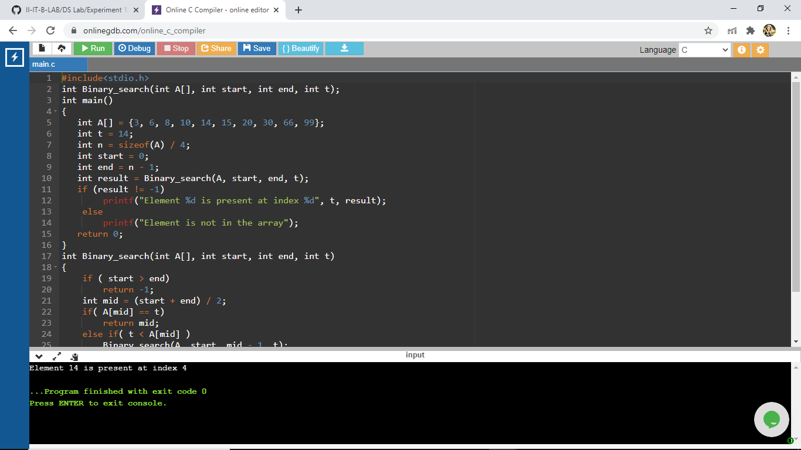

# Aim Of The Experiment
Write a program that use recursive functions to perform the binary search operation for a key value in a given list of integers
## Description
Binary Search is Searching a sorted array by repeatedly dividing the search interval in half. Begin with an interval covering the whole array. If the value of the search key is less than the item in the middle of the interval, narrow the interval to the lower half. Otherwise narrow it to the upper half. Repeatedly check until the value is found or the interval is empty
### Step-by-step procedure for the Output
# First target number : 6
1.Give the values of the array and take the number of elements in the array as n and t as the target number and the start is equal to 0 and end is equal to n - 1

2.Write a function with name binary search and will return -1 if start value is less than end value if not then mid term is equal to start + end / 2. If the mid term is equal to the target number then the index of the mid term will be returned or else if the target number is less than the mid value then call binary search function again with end value = mid term index - 1 and if the target number is greater than the mid term then call the binary search function again with the start value = mid term index + 1.This will repeat till the target number is found or if the element is not in the array

3.Here the given array is {3, 6, 8, 10, 14, 15, 20, 30, 66, 99} and the target number is 6.the mid term will be 0 + 9/ 2 which can be considered as 4.so the mid term is 4th index element i.e 14. the target value is not equal to the mid term value, and since the target value is less than the mid term value binary search function is called again with the end = mid - 1. now the start = 0 and end = 3 then the mid term = 0 + 3/ 2 i.e can be taken as 1. now the mid term is 1st index element i.e 6.now the target number is equal to the mid term value then the mid term index is returned i.e 1

4.The output is : Element 6 is present at the index 1

# Second target number : 14
1.Give the values of the array and take the number of elements in the array as n and t as the target number and the start is equal to 0 and end is equal to n - 1

2.Write a function with name binary search and will return -1 if start value is less than end value if not then mid term is equal to start + end / 2. If the mid term is equal to the target number then the index of the mid term will be returned or else if the target number is less than the mid value then call binary search function again with end value = mid term index - 1 and if the target number is greater than the mid term then call the binary search function again with the start value = mid term index + 1.This will repeat till the target number is found or if the element is not in the array

3.Here the given array is {3, 6, 8, 10, 14, 15, 20, 30, 66, 99} and the target number is 14.the mid term will be 0 + 9/ 2 which can be considered as 4.so the mid term is 4th index element i.e 14. the target value is equal to the target number. so the mid term index is returned i.e 4

4.The output is : Element 14 is present at index 4

# Third target number : 99
1.Give the values of the array and take the number of elements in the array as n and t as the target number and the start is equal to 0 and end is equal to n - 1

2.Write a function with name binary search and will return -1 if start value is less than end value if not then mid term is equal to start + end / 2. If the mid term is equal to the target number then the index of the mid term will be returned or else if the target number is less than the mid value then call binary search function again with end value = mid term index - 1 and if the target number is greater than the mid term then call the binary search function again with the start value = mid term index + 1.This will repeat till the target number is found or if the element is not in the array

3.Here the given array is {3, 6, 8, 10, 14, 15, 20, 30, 66, 99} and the target number is 6.the mid term will be 0 + 9/ 2 which can be considered as 4.so the mid term is 4th index element i.e 14. the target value is not equal to the mid term value, and since the target value is greater than the mid term value, binary search function is called again with the start = mid + 1. now the start = 5 and end = 9 then the mid term = 9 + 5 / 2 i.e 7. now the mid term is 7th index element i.e 30.The mid term value is not equal to the target number, and sice the target value is greater than the mid term value, binary search function is called again with the start = mid + 1.now the start = 8 and end = 9 and mid term index = 9 + 8 / 2 i.e 8.now the mid term is 8th index element i.e 66.the mid term value is not equal to the target number, and since the target number is greater than the mid term value, binary search function is called again with start = 9 and end = 9. so the mid term = 9 + 9 / 2 = 9.now the mid term is 9th index element i.e 99.the target number is equal to the mid term value then the mid term index is returned i.e 9

4.The output is : Element 99 is present at the index 9

