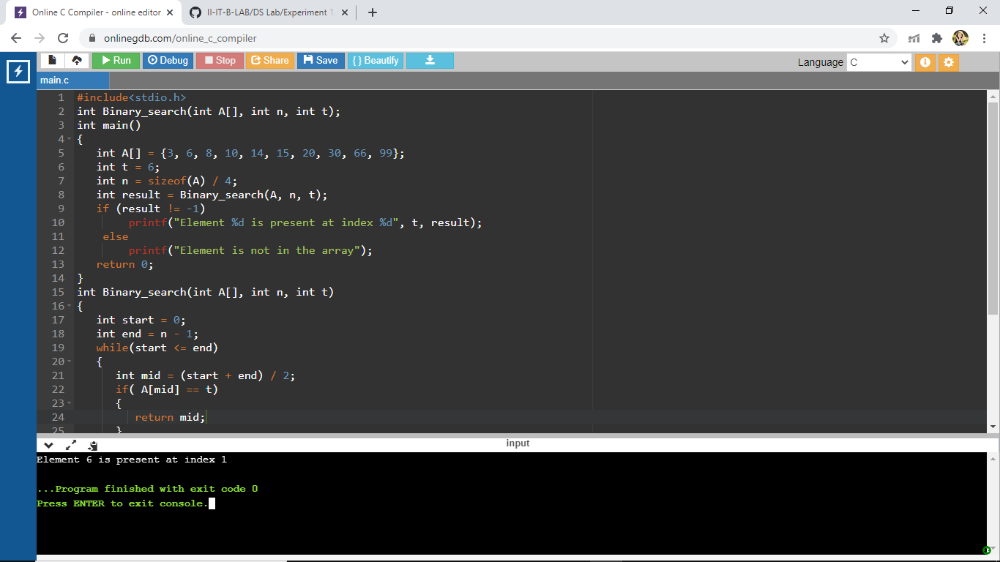

# Aim Of The Experiment
Write a program that uses non-recursive search to perform the binar search operation to find a key value in the given list of integers
## Description
Binary Search is Searching a sorted array by repeatedly dividing the search interval in half. Begin with an interval covering the whole array. If the value of the search key is less than the item in the middle of the interval, narrow the interval to the lower half. Otherwise narrow it to the upper half. Repeatedly check until the value is found or the interval is empty
### Step-by-step procedure for the output
1.First, take the elements of the array and sort it in a ascending order and take the number of elements as n and the target number as t

2.Write a function with name binary search which will initialize the values of the start and  end of the array as 0 and n - 1

3.While checking the condition if start is less than or equal to end, it will enter into a if else if loop where the mid term index is found by adding the start with end and dividing it by 2 and if mid term is equal to target number then the index of the mid term is retuened and if target number is less than the mid term then the left side of the mid term will be considered as an whole array with the end value equal to mid term index - 1, simultaneously if the target number is greater than the mid term the right side part of the mid term will be considered as whole array with the start value equal to mid term index + 1.This will repeat till we find our target number or when the target number is not present in the array

4.Given the array is {3, 6, 8, 10, 14, 15, 20, 30, 66, 99} and the target number is 6. first the mid term index will be 0 + 9 / 2 which we can consider as 4.so the mid term is 4th index element i.e 14, 6 is less than 14 so consider the left part of the mid term with start = 0 and end = 3, then mid = 0 + 3 / 2 i.e 1. mid term is now 1st index element i.e 6 , here t is equal to mid term.so the index 1 is returned

5.The output is : Element 6 is present at index 1

