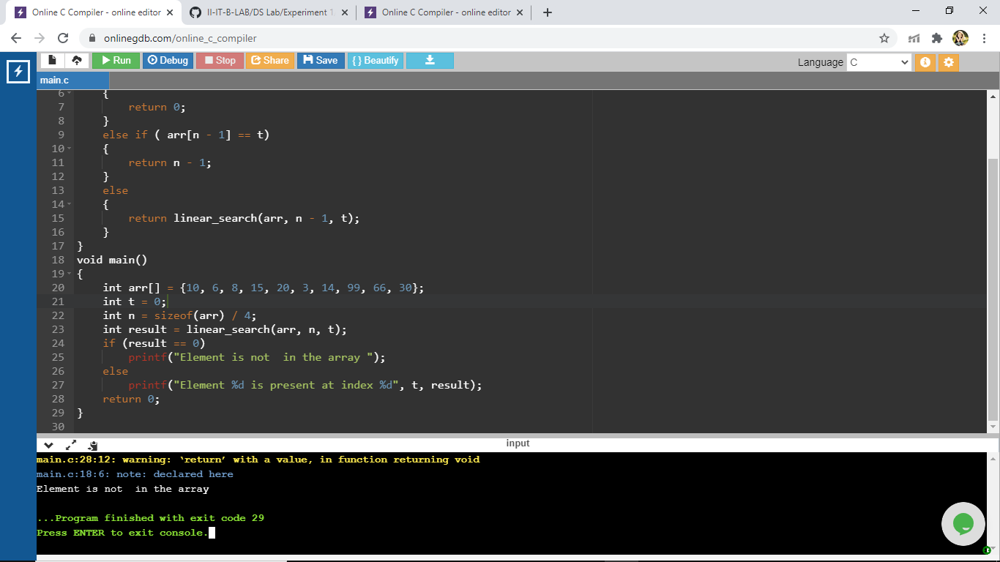

# Aim Of The Experiment
Write a program that use recursive functions to perform the linaer search opeation for a key value in a given list of integers
## Description
A linear search is a method for finding an element within a list. It sequentially checks each element of the list until a match is found or the whole list has been searched
### Step-by-step procedure for the Output
1.Give the values of the array and take the number of elements in the array as n and the target number as t

2.Write a fuction with name linear search which will return 0 when the n will become 0, will return the index of the number if the target number is equal to the number and if not then call the linear seach function again with number of elements of the array decresed by 1

3.Here the given array is {10, 6, 8, 15, 20, 3, 14, 99, 66, 30} and the target number is 66. first the n value is 10 since n value is not zero it will go to the next condition that it will check the 9th index element with the target number and since the condition is not satisfied it will go to the next condition in which the linear search function will be called again with the number of elements decreased by 1, this will repeat till the value 0 is returned or the index of the target value is returned.

4.Here since the element is 66. the value of n is 10 since the n is not 0 it will check the 9th index element with the target number and 30 is not equal to 66 then the linear search function is called again with the number of elements 9 and again n is not equal to 0 then the element of the 8th index is checked with the target number and that condition is true so the index will return i.e 8

5.The output is : Element 66 is present at the index 8

1.Give the values of the array and take the number of elements in the array as n and the target number as t

2.Write a fuction with name linear search which will return 0 when the n will become 0, will return the index of the number if the target number is equal to the number and if not then call the linear seach function again with number of elements of the array decresed by 1

3.Here the given array is {10, 6, 8, 15, 20, 3, 14, 99, 66, 30} and the target number is 0. first the n value is 10 since n value is not zero it will go to the next condition that it will check the 9th index element with the target number and since the condition is not satisfied it will go to the next condition in which the linear search function will be called again with the number of elements decreased by 1, this will repeat till the value 0 is returned or the index of the target value is returned.

4.Here since the target value 0 is not present in the array the linear search will repeat till the n value becomes 0 and will return the value 0

5.The output is : Element is not in the array

