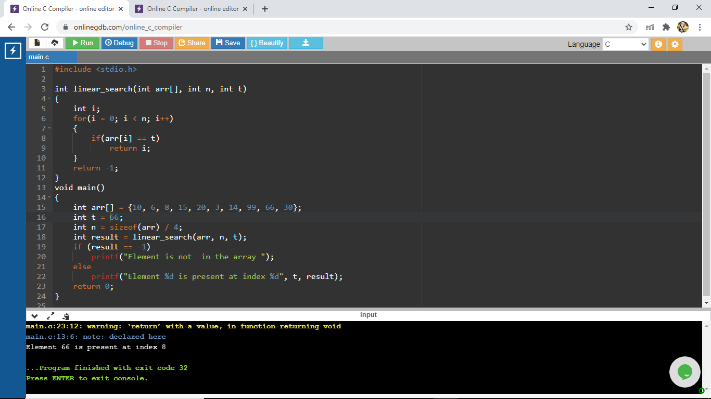
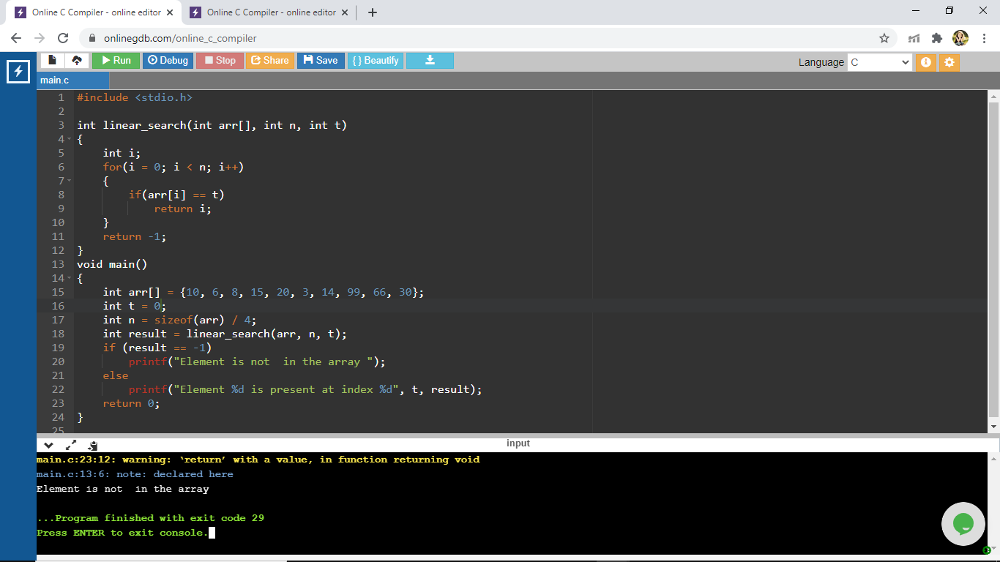

# Aim Of The Experiment
Write a program that use non-recursive functions to perform the linear searching operations for a key value in a given list of integers
## Description 
A linear search  is a method for finding an element within a list. It sequentially checks each element of the list until a match is found or the whole list has been searched
### Step by step procedure for the experiment
1.Define a function linear search which will return the index of the given key value if the value is present in the the list and will return -1 if the key value is not present in the list 

2.Write the main function and call the linear search function in the main function
### Output Obtained
As we know that linear search checks each element of the list one by one until the match is found and will return the index value. Here the given array is {10, 6, 8, 15, 20, 3, 14, 99, 66, 30} and the target number is 66. so, it starts checking from first element of the array to the last element of the array till the target number is found and then will return the index value.so the key value for 66 is 8

The next element to find in the given array is 0.so the target value will be cross checked with the first element to the last element till the target value is found and since 0 is not in the given array, it will return -1 and the output prints as the element 0 is not present in the given array.

