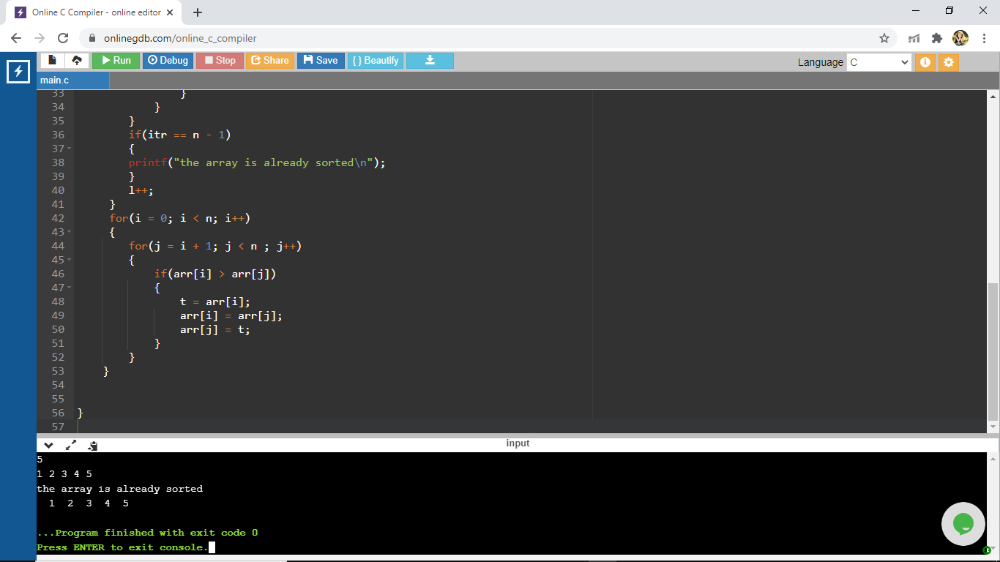

# Aim Of The Experiment
Write a program that implements bubble sort method to sort a given list of integers in ascending order
# Description
### Bubble Sort
Bubble Sort is the simplest sorting algorithm that works by repeatedly swapping the adjacent elements if they are in wrong order
# Step-by-step procedure for the output
##First Output

1. The program contains 2 functions i.e main fuction and the bubble sort function which returns that "the array is already sorted" if the array is already sorted and if the array is not sorted , it will return the sorted array.

2.The given array is {7, 1, 6, 13, 28}

3.Since the number of elements are 5, the no. of iterations done to reach the sorted array is 4

1st iteration [7 1 6 13 28]
              [1 7 6 13 28]
              [1 6 7 13 28]
              [1 6 7 13 28]
              [1 6 7 13 28]
4.Generally, after 1st iteration the last element will be fixed, after the 2nd iteration the last before element will be fixed and soon.But here after the 1st iteration only the array is sorted, so the final values are returned

5.The result is : 1, 6, 7, 13, 28

## Second Output

1. The program contains 2 functions i.e main fuction and the bubble sort function which returns that "the array is already sorted" if the array is already sorted and if the array is not sorted , it will return the sorted array.

2.The given array is {-1, 8, 12, 6, -4, 11, 3, -2, 1, 9}

3.Since the number of elements are 10, the no. of iterations done to reach the sorted array is 9

1st iteration [-1 8 12 6 -4 11 3 -2 1 9]
              [-1 8 12 6 -4 11 3 -2 1 9]
              [-1 8 12 6 -4 11 3 -2 1 9]
              [-1 8 6 12 -4 11 3 -2 1 9]
              [-1 8 6 -4 12 11 3 -2 1 9]
              [-1 8 6 -4 11 12 3 -2 1 9]
              [-1 8 6 -4 11 3 12 -2 1 9]
              [-1 8 6 -4 11 3 -2 12 1 9]
              [-1 8 6 -4 11 3 -2 1 12 9]
              [-1 8 6 -4 11 3 -2 1 9 12]
2nd iteration [-1 8 6 -4 11 3 -2 1 9 12]
              [-1 8 6 -4 11 3 -2 1 9 12]
              [-1 6 8 -4 11 3 -2 1 9 12]
              [-1 6 -4 8 11 3 -2 1 9 12]
              [-1 6 -4 8 11 3 -2 1 9 12]
              [-1 6 -4 8 3 11 -2 1 9 12]
              [-1 6 -4 8 3 -2 11 1 9 12]
              [-1 6 -4 8 3 -2 1 11 9 12]
              [-1 6 -4 8 3 -2 1 9 11 12]
3rd iteration [-1 6 -4 8 3 -2 1 9 11 12]
              [-1 6 -4 8 3 -2 1 9 11 12]
              [-1 -4 6 8 3 -2 1 9 11 12]
              [-1 -4 6 8 3 -2 1 9 11 12]
              [-1 -4 6 3 8 -2 1 9 11 12]
              [-1 -4 6 3 -2 8 1 9 11 12]
              [-1 -4 6 3 -2 1 8 9 11 12]
              [-1 -4 6 3 -2 1 8 9 11 12]
              [-1 -4 6 3 -2 1 8 9 11 12]
4th iteration [-1 -4 6 3 -2 1 8 9 11 12]
              [-4 -1 6 3 -2 1 8 9 11 12]
              [-4 -1 6 3 -2 1 8 9 11 12]
              [-4 -1 3 6 -2 1 8 9 11 12]
              [-4 -1 3 -2 6 1 8 9 11 12]
              [-4 -1 3 -2 1 6 8 9 11 12]
5th iteration [-4 -1 3 -2 1 6 8 9 11 12]
              [-4 -1 3 -2 1 6 8 9 11 12]
              [-4 -1 3 -2 1 6 8 9 11 12]
              [-4 -1 -2 3 1 6 8 9 11 12]
6th iteration [-4 -1 -2 3 1 6 8 9 11 12]
              [-4 -1 -2 3 1 6 8 9 11 12]
              [-4 -2 -1 3 1 6 8 9 11 12]
              [-4 -2 -1 3 1 6 8 9 11 12]
              [-4 -2 -1 1 3 6 8 9 11 12]
              
4.Generally, after 1st iteration the last element will be fixed, after the 2nd iteration the last before element will be fixed and soon.But here after the 1st iteration only the array is sorted, so the final values are returned

5.The result is : -4, -2, -1, 1, 3, 6, 8, 9, 11, 12

## Third Output

1. The program contains 2 functions i.e main fuction and the bubble sort function which returns that "the array is already sorted" if the array is already sorted and if the array is not sorted , it will return the sorted array.

2.The given array is {1, 2, 3, 4, 5}

3.Since the number of elements are 5, the no. of iterations done to reach the sorted array is 4

4.But the array is already sorted which will be proved by the condition applied in the bubblesort function, it will check if the first element is less than than second element and if the second element is less than the third element and soon till the last element

5.The result is : The array is already sorted
                  1, 2, 3, 4, 5
                  

              

            

